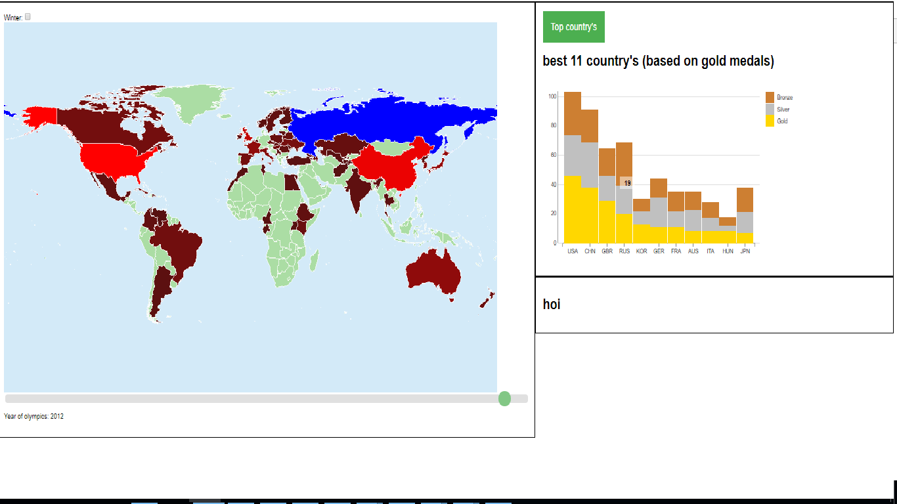
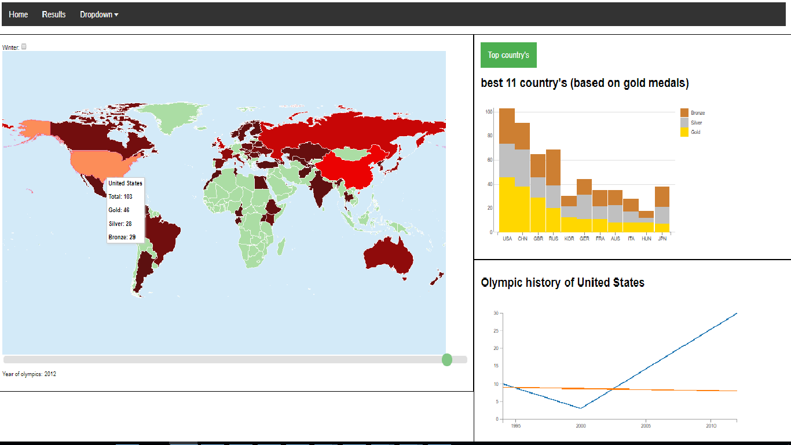

#day 1
mainly focussed on fixing bugs coming from DATA MAPS (map format i use). additionally i looked for how i wanted my stacked barchart to look like

#day 2
inplemented the stacked barchart, it represents data of the top x country's of the selected year

i have yet to decide how many country's i wil represent, but i think it will be 10.
maybe i will add a function where the country on the maps can be selected and will be added in the barchart

#day3
when a bar of the stacked bar chart is hovered then the matching country is given a defferent color in the
map

when a country on the map is clicked, a linegraph giving the olympic history of that country is shown

