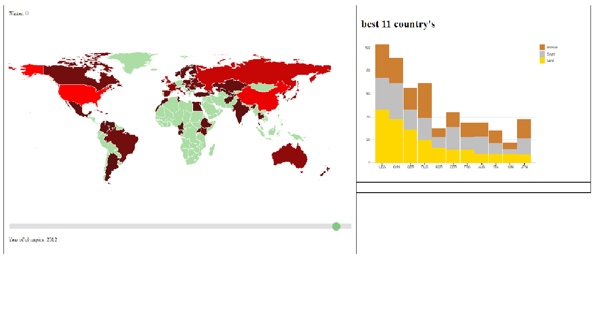
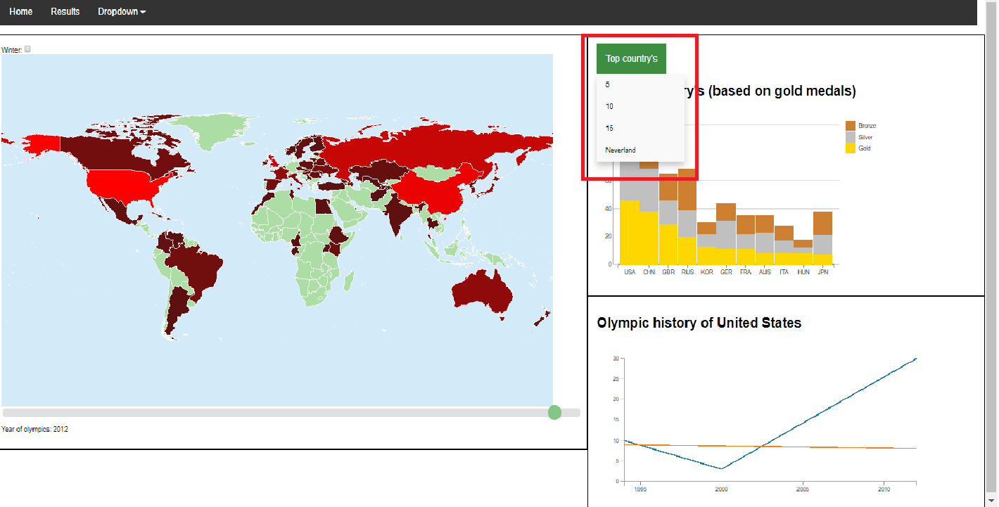

# day 1
mainly focussed on fixing bugs coming from DATA MAPS (map format i use). additionally i looked for how i wanted my stacked bar chart to look like

# day 2
implemented the stacked bar chart instead of bullet chart, it represents data of the top x country's of the selected year

i have yet to decide how many country's i will represent, but i think it will be 10.
maybe i will add a function where the country on the maps can be selected and will be added in the bar chart

# day3
when a bar of the stacked bar chart is hovered then the matching country is given a different colour in the
map

when a country on the map is clicked, a line graph giving the olympic history of that country is shown

# day4
due to the weather there was not very much progress, i added a dropdown menu which can be used to select the amount of top country in the stackedbar chart. additionally a fixed some bugs and added some data

# day5

gathered the rest of the remaining data and did some debugging.

got some idea's from the presentations

# day6

the sliders of the years have been changed to only contain the years the olympics happendend and not when thy were skipped (examples: 1940, 1944, 1948). i decided to make the slider linear over the years that the Olympics took place.

the toggle to choose between summer and winter is now styled and fully functional

# day 7

lines in Line graph are continuous, when a country did not compete for a year in between this is shown as an intermediate between the previous and next time they participated.

the lines are between the latest and earliest time a country competed.

# day 8

when hovering the stacked bar chart dotted lines representing the history of that country are added in the line graph

i choose to do this relative and not absolute because this is more in the theme of comparison through history

# day 9

fixed bugs that gave some update isues

# day 10

finished product
