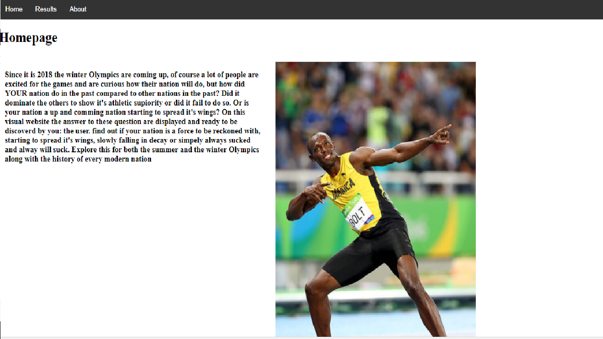
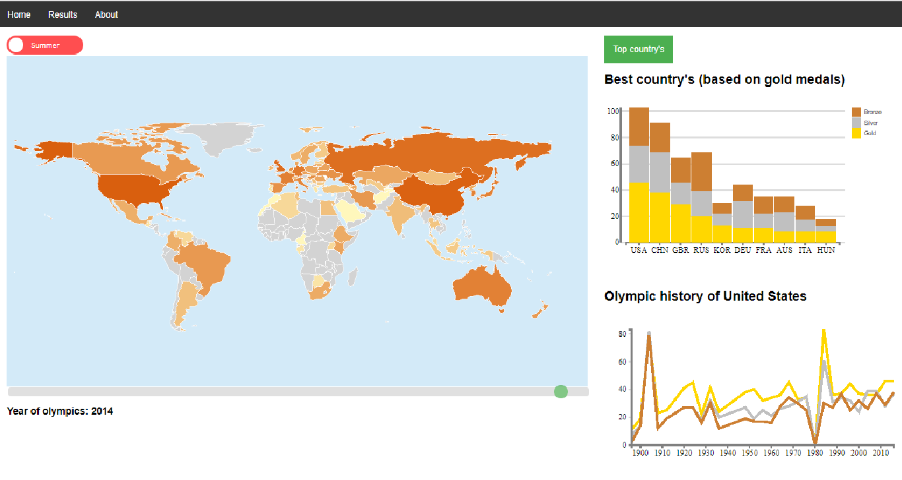
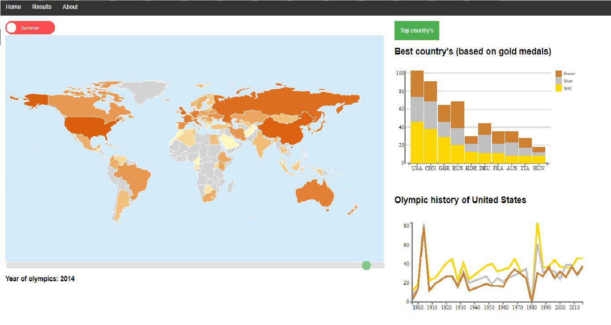

This project is licensed under the terms of the MIT license.

/Project/javascript/map.js is licensed by Mark DiMarco (https://github.com/markmarkoh) under the terms of MIT license. (https://datamaps.github.io/)

# github Pages
https://github.com/minordavid/ProgrameerProject/.

# Introduction

Since it is 2018, the winter Olympics are coming up, of course a lot of people are excited for the games and are curious how their nation will do, but how did their nation do in the past compared to other country's? In this project the answer to this question is displayed for both the summer and the winter Olympics along with the history of every modern nation

# Solution
Home page

Results page

- a website that gives a visualisation of various Olympic results through the years and the medals won by country's through the years
- MAIN FEATURES: Interactive map of the world, graph that shows the results through the years and a interactive stacked bar chart. additionally a slider, toggle and dropdown are used

About page

# Prerequisites

- Data scource:
Data: https://www.theguardian.com/sport/datablog/2012/jun/25/olympic-medal-winner-list-data#data
eerste plek op spelen: https://www.olympic.org/olympic-results data moet waarschijnlijk gescraped worden
medal table: https://en.wikipedia.org/wiki/2016_Summer_Olympics_medal_table scrapen of met excel

  doping: https://en.wikipedia.org/wiki/Doping_at_the_Olympic_Games scrapen of met excel
  doping: https://sportsanddrugs.procon.org/view.resource.php?resourceID=004420 with hand

- external components:
d3 tip needs to be used and maybe a library for maps

- similar:
there is a site that represents the medals won by country's over years, but this one uses bubles and is not interactive, also there
is no linked graph http://rio2016.thegamma.net/

  elsewhere they have a different visualization but once again very different http://www.nytimes.com/interactive/2008/08/04/sports/olympics/20080804_MEDALCOUNT_MAP.html

- hardest parts:
staying sane when the code does not work
I think the scraping/getting data will take a lot of time
the hardest part will be linking the dropdown menus with the graph and the slider with the map and the map with the graph

# bettercodehub

