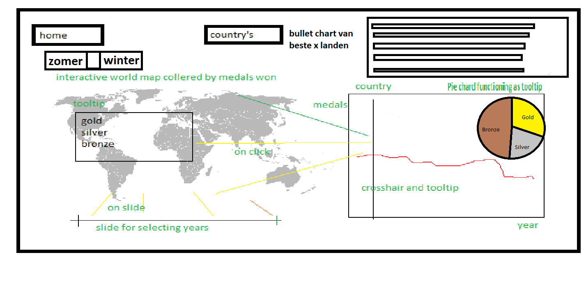

we hear a lot about how top athletes are improving and about new records, however we do not fully understand
how impressive these people are and how they compare to their predecessors. also it is nice to see how the country's
participating in the Olympics changed, which country improved and which country's lost their golden touch

# Solution
homepage

result page

country page

doping page(optional)
.png)

- a website that gives a visualisation of various Olympic results through the years and the medals won by country's through the years

- MAIN FEATURES: dropdown menu to select a sport and gender, interactive graph that shows the results through the years
  with a tooltip.
  a map of the world where the country's are coloured with corresponding to the amount of medals won, with a tooltip and a graph linked to it.
  a slider can be used to update the map

  *optionally the amount of people cought for using doping and which doping are represented in a graph*

# Prerequisites

- Data scource:
Data: https://www.theguardian.com/sport/datablog/2012/jun/25/olympic-medal-winner-list-data#data
eerste plek op spelen: https://www.olympic.org/olympic-results data moet waarschijnlijk gescraped worden
medal table: https://en.wikipedia.org/wiki/2016_Summer_Olympics_medal_table scrapen of met excel

  doping: https://en.wikipedia.org/wiki/Doping_at_the_Olympic_Games scrapen of met excel
  doping: https://sportsanddrugs.procon.org/view.resource.php?resourceID=004420 with hand

- external components:
d3 tip needs to be used and maybe a library for maps

- similar:
there is a site that represents the medals won by country's over years, but this one uses bubles and is not interactive, also there
is no linked graph http://rio2016.thegamma.net/

  elsewhere they have a different visualization but once again very different http://www.nytimes.com/interactive/2008/08/04/sports/olympics/20080804_MEDALCOUNT_MAP.html

- hardest parts:
staying sane when the code does not work
I think the scraping/getting data will take a lot of time
the hardest part will be linking the dropdown menus with the graph and the slider with the map and the map with the graph
