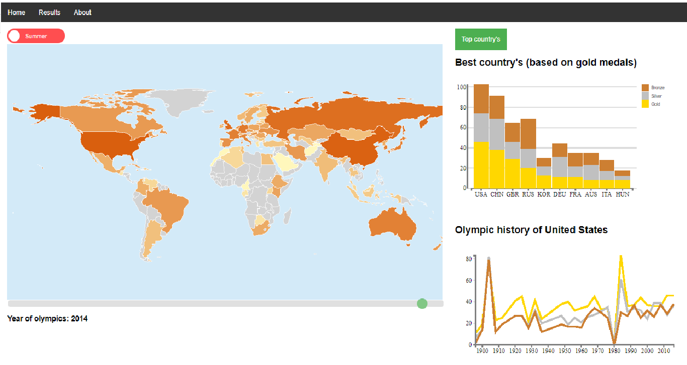

# (Short) Description
Since it is 2018, the winter Olympics are coming up, of course a lot of people are excited for the games and are curious how their nation will do, but how did their nation do in the past compared to other country's? In this project the answer to this question is displayed for both the summer and the winter Olympics along with the history of every modern nation

# Technical Design

All JavaScript is divided in the file's main.js (main code, calls other code), map.js (external code from http://datamaps.github.io/, to draw and update the worldmap), updateMap.js(calls functions from maps.js to update the map), lineGraph.js (draws and updates the line graph) and stackedBarChart.js (draws and updates the stacked bar chart).

The JavaScript of this page works by first running the code in the main.js, in main.js the map is first drawn and then filled by calling updateMap.js. main.js also calls lineGraph and barChart (functions from lineGraph.js and stackedBarChart.js).
""""""""To draw the line graph showing the Olympic history of a nation and a stacked bar chart showing the best N (N = 5, 7, 10) nations of a selected year. main.js also contains the functions for the dropdown, toggle and slider.
When the dropdown is used, the update function from updateMaps.js is called which then calls the update function from stackedBarChart.js to update the bar chart.
When the toggle is used, either the slider for summer of winter is displayed and updateMap from updateMap.js is called to update the wold map to the right year of summer or winter games. Also lineGraph from lineGraph.js is called to update the line graph to show the olympic history of a nation in either the winter or summer games.
There are Two sliders, only one is being displayed based on the status of the toggle, when a slider is used updateMap from UpdateMap.js is called to update the data in the world map and change the colors to match this data. then UpdateMap calls barChart form stackedBarChart.js to update the barchart to match the selected year.

When the world map is made, it is given a functionality that when hovered a tooltip containing data of that country is shown and when a country is clicked lineGraph from lineGraph.js is called to update the line graph.
When the stacked bar chart is hovered updateLine is called from lineGraph.js to draw a dotted line in the line graph that shows the history of that nation (relatively) against the selected country.

# Challenges and Changes

In the begin it was challenging to work with the Datamaps, but eventually I figured it out with the documentation on http://datamaps.github.io/.

being able to display the right year for summer and winter Olympics as well as always displaying the right data when a toggle, slider or dropdown was used was not challenging in the sense that is was very hard, but that it was a lot of trial and error.

one of the hardest challenges was to make a json with a varying key "(json:{{USA:{Fill:...}, CAN:{Fill:...}, CHN:{Fill:...}}})".

Instead of making a bullet chart i decided to make a stacked bar chart, I did this because a stacked bar chart was a better match for my data than a bullet chart. A bullet chart is very useful to compare very different types of data, for example when you want to compare percentages with absolute numbers, or when comparing decimals with number of 10*5. My data was in the same realm of numbers therefor I choose to use a stacked bar chart.

In my project proposal I had planned to make a tooltip for the line graph as a pie chart, but i didn't think this would add anything to the visualisation and since a pie chart is very easy to implement and not very challenging I skipped this.

I also added a html dropdown, mostly because I thought it would be a nice addition for the user to select the amount of top country's he/she wants to see. In my project proposal I also didn't have a interactivity between the bar chart and line graph, but is implemented this anyway (mostly because it seemed like a nice challenge).

# Ideal World
If I had more time, I think I would have implemented more functionality in the line graph, for example a crosshair and when you click when the crosshair was on a certain year, the map and bar chart would update to this year.
